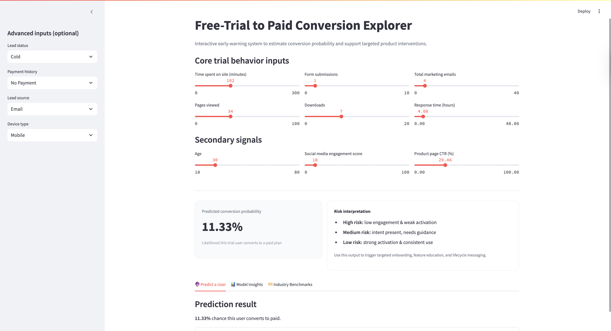
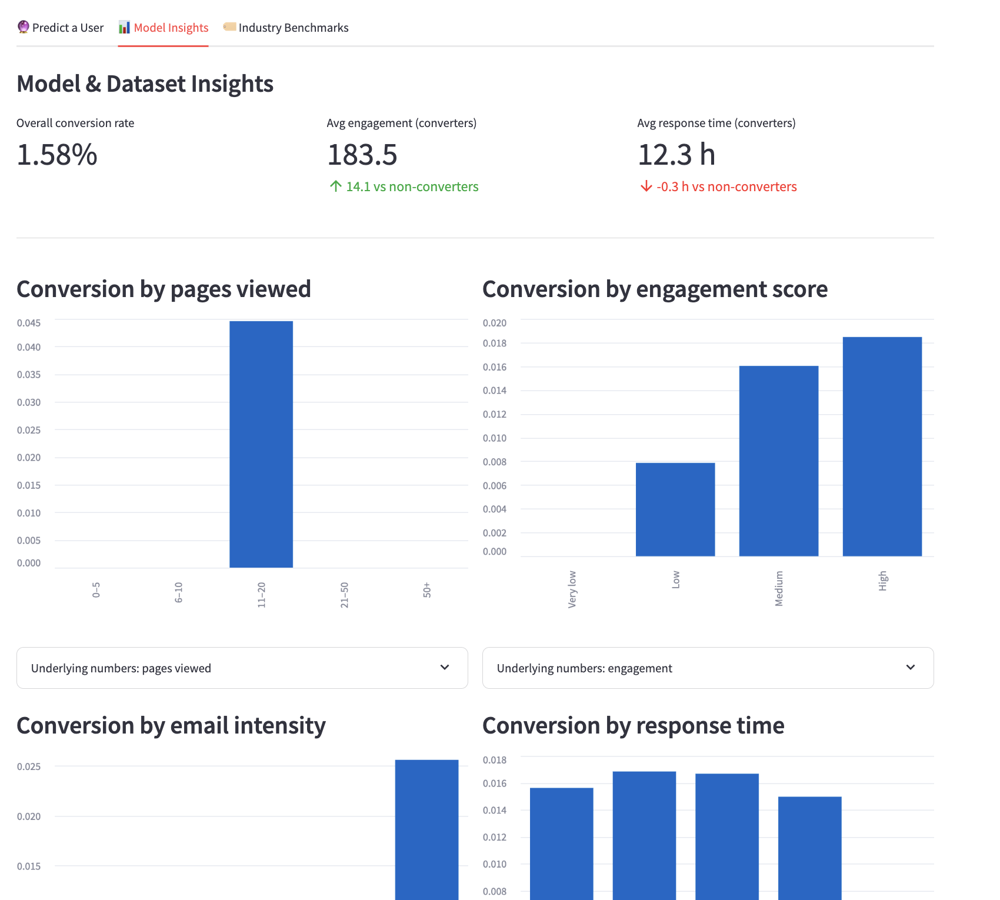
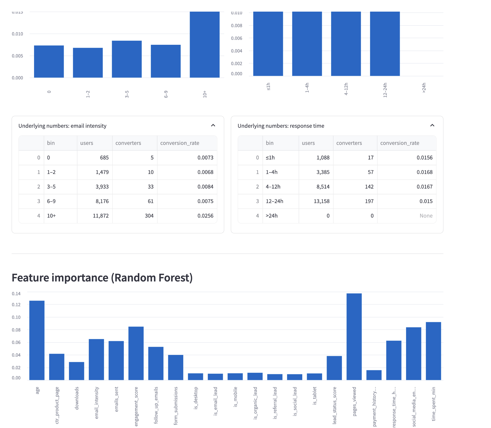
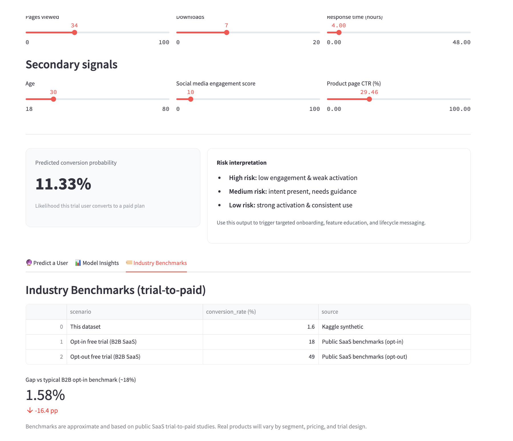

# Free-to-Paid Conversion - Early Warning System

An interactive product analytics tool that predicts trial-to-paid conversion risk and helps product teams intervene before users churn.

## Problem Context

Free trials are widely used to acquire users, but a significant portion never convert to paid plans. 
Most teams only learn this after the trial ends — when it’s already too late to intervene.

This project explores how product teams can:
- Identify at-risk trial users early
- Understand which behaviors signal conversion intent
- Trigger targeted onboarding and lifecycle interventions

## What I Built

I built an end-to-end early warning system that:
- Predicts the probability that a trial user converts to paid
- Explains *why* the model makes that prediction
- Visualizes behavioral patterns across the full trial population

The system is deployed as an interactive Streamlit app and supported by a machine learning model trained on behavioral data.

## Product Walkthrough

### 1. Predict a User

Simulate a trial user’s behavior and see the predicted conversion probability in real time.

### 2. Model Insights Dashboard

Explore how engagement, response time, emails, and other signals correlate with conversion.

### 3. Key Conversion Drivers

Understand which behaviors most strongly influence conversion probability.

### 4. Industry Benchmarks

Compare the dataset’s conversion rate against common B2B SaaS benchmarks.

## Data & Modeling Approach

- Synthetic trial user dataset (Kaggle)
- Behavioral signals: engagement, emails, response time, lead attributes
- Random Forest classifier for interpretability and non-linear interactions
- Feature importance used to support product decision-making, not just prediction

## Key Product Insights

- High engagement alone is not enough — response time and follow-ups matter
- Excessive emails show diminishing returns beyond a threshold
- Pages viewed and engagement score are strong early indicators of intent
- Cold leads benefit more from onboarding nudges than marketing pressure

## How This Would Be Used in a Real Product

- Trigger onboarding prompts for high-risk users
- Prioritize CSM or sales follow-ups for medium-risk users
- Reduce unnecessary email volume for low-risk users
- Monitor trial health at a cohort level

## Expected Impact (Simulated)

Using a realistic synthetic subscription dataset, this system demonstrates how early risk detection could enable meaningful product interventions.

Based on scenario analysis and benchmarked assumptions, a product team using this system could expect:
- Improved free-to-paid conversion through earlier, targeted interventions
- Reduced inactive trial churn by identifying disengaged users before trial expiry
- Faster time-to-first-value by prioritizing onboarding and feature education for high-risk users

These results are illustrative and intended to demonstrate decision-making value rather than claim measured production impact.

## Live App & Code

- Live app: https://varshithagudibandi-free-trial-conversion-early-wa-appapp-wukmhg.streamlit.app/
- Source code: https://github.com/VarshithaGudibandi/free-trial-conversion-early-warning-system

## Notebook

The full modeling workflow and exploratory analysis are available in:
- notebooks/Free_trail_to_paid_modeling.ipynb

## Tech Stack
- Python
- Pandas, NumPy
- Jupyter Notebook
- Streamlit (or CLI-based tool)
- Cursor (AI-assisted development for rapid iteration)
